<!-- The hero images are generated by dfwb-research/.github (repos/dfwb-torch/); copy them from there, never edit them here. -->

<picture>
  <source media="(prefers-color-scheme: dark)" srcset="docs/assets/hero-dark.svg">
  
</picture>

Small, clean, **standalone** PyTorch building blocks for media forensics that are useful in
*anyone's* code: a paper, a Kaggle kernel, another framework. Each package here is its own
distribution (`dfwb-torch-<name>`), versioned and released independently of the others, whose
only runtime dependency is `torch` (plus `numpy` where genuinely needed). None of them depends on
`deepfake-workbench`. A package may optionally self-register with
[Deepfake Workbench](https://github.com/dfwb-research/deepfake-workbench) through the
`dfwb.plugins` entry point, which lets the framework adopt it automatically when both are
installed — but every package installs, imports and runs standalone with nothing but `torch`.

> **Status:** pre-release. Nothing is released on PyPI yet; install from a clone.
> Linux is the only supported and tested OS. Python ≥ 3.12.

## Run from a clone

```bash
git clone https://github.com/dfwb-research/dfwb-torch && cd dfwb-torch
uv sync
```

`uv sync` installs every package here, with the CPU build of PyTorch the lockfile pins. Each
package also installs on its own, from the clone (`pip install ./packages/srm`) or straight from
its git URL, and has its own quickstart in its `README.md` -- but outside this workspace, pip
resolves PyPI's own default `torch` wheel, which is the CUDA build, even on a CPU-only machine.
Install the torch build you need first: CPU, `pip install torch --index-url
https://download.pytorch.org/whl/cpu`; CUDA, [pytorch.org's
selector](https://pytorch.org/get-started/locally/). Then install the package.

## Quickstart

`dfwb-torch-srm`, the only package here so far, building an `SRMConv2d` layer and applying it
to a tensor (run it with `uv run python` in the clone):

```python
import torch
from dfwb_torch_srm import SRMConv2d

layer = SRMConv2d(in_channels=3, bank="srm30", mode="gray")
x = torch.rand(1, 3, 64, 64)
y = layer(x)
```

See [`packages/srm/README.md`](packages/srm/README.md) for the full quickstart, the kernel
banks it ships, and its other modes.

## Packages

| Package | What | Status | PyPI |
|---|---|---|---|
| [`srm`](packages/srm) | SRM and high-pass residual filter banks (Fridrich & Kodovský 2012; Zhou et al. 2018) for PyTorch | pre-release (`0.1.0rc1`), not yet on PyPI | [](https://pypi.org/project/dfwb-torch-srm/) |

## Using it with Deepfake Workbench

A package installed in the same environment as the framework registers its layers as
framework components, and `dfwb plugins list` shows them: `dfwb-torch-srm` registers the
`srm` layer. Deepfake Workbench 0.1.0b1 and later put a registered layer in front of any image
backbone as a model stem, from the training config:

```yaml
model:
  stem: {name: srm, bank: srm30, mode: gray}
```

[`packages/srm/README.md`](packages/srm/README.md#using-it-with-deepfake-workbench) says how the
framework builds it, and what the stem sees; the framework's README shows how to install a
package into a framework clone.

## Adding a package

`uv run python scripts/new_package.py <name> --summary "..."` renders the template in
`template/` into `packages/<name>`, and `uv run python scripts/check_package.py packages/<name>`
checks a package against it; commit the `uv.lock` that `uv` updates for the new workspace member
too. A new package needs a concrete user, no well-maintained equivalent, and its API specified
and reviewed before it lands here.

## Releasing a package

Each package is tagged and released independently, one tag-day PR at a time:

1. Set `__version__` in `packages/<name>/src/dfwb_torch_<name>/__init__.py`.
2. Set `version` and `date-released` in `packages/<name>/CITATION.cff`.
3. Rename the package's `CHANGELOG.md` `## [Unreleased]` section to `## [x.y.z] - YYYY-MM-DD`.
4. Replace the "not on PyPI yet" install text in `packages/<name>/README.md` -- PyPI renders
   that file as the project description, which cannot change without a new release -- and in
   this file's `## Packages` table.
5. Run `uv lock --check`; if the version change left `uv.lock`'s own pin for the package stale,
   run `uv lock` and commit the updated `uv.lock` too.
6. Merge the PR, then tag the merge commit `<name>-v<x.y.z>` (e.g. `srm-v0.1.0`) and push the
   tag.
7. `release.yml` takes it from there: it checks the tag's version against `__version__` and
   `CITATION.cff`'s `version` (refusing a mismatch), builds and publishes to PyPI through
   trusted publishing, and creates a GitHub release linking to the package's changelog -- marked
   a prerelease for an alpha/beta/rc/dev version, and never flipping this repository's "Latest
   release" marker (packages are versioned independently, so no single release is *the* latest
   for all of them). Approve the `pypi` environment when GitHub prompts for it.

## The DFWB repositories

Three repositories make up [DFWB Research](https://github.com/dfwb-research); the organisation
profile also lists the datasets in preparation.

| Repository | What it holds |
|---|---|
| [deepfake-workbench](https://github.com/dfwb-research/deepfake-workbench) | The framework: verified dataset inventories, face preprocessing, training, scoring any detector, and evaluation with uncertainty. One `dfwb` command. |
| [dfwb-protocols](https://github.com/dfwb-research/dfwb-protocols) | Versioned train, validation and test splits for public deepfake datasets, CC BY 4.0. Installed next to the framework, it adds its protocols and evaluation suites. |
| [dfwb-torch](https://github.com/dfwb-research/dfwb-torch) | Small, standalone PyTorch utilities for media forensics, starting with `dfwb-torch-srm`. Installed next to the framework, a package registers its layers as plugins. |

## Licence

MIT. See [`LICENSE`](LICENSE). Each package's licence is also MIT and is packaged with its own
distribution.

## Principles

**Small and standalone.** Every package here installs, imports and runs with nothing but
`torch` (plus `numpy` where genuinely needed); none of them depends on `deepfake-workbench`.

**Optional DFWB plugin.** A package may self-register with
[Deepfake Workbench](https://github.com/dfwb-research/deepfake-workbench) through the
`dfwb.plugins` entry point, adopted automatically when both are installed -- but that
integration is always optional, and every package works standalone with nothing but `torch`.

## Cite this work

There is no single citation for this repository: each package is versioned and cited on its
own, from its own `CITATION.cff` (`srm`'s is
[`packages/srm/CITATION.cff`](packages/srm/CITATION.cff)), together with the original papers
its README lists. GitHub's "Cite this repository" button reads only a `CITATION.cff` at the
repository's root, so it does not appear here.

## Maintainer

[Luke Collins](https://github.com/lukegcollins), Deakin University
([ORCID 0009-0002-7771-1081](https://orcid.org/0009-0002-7771-1081)).

Contributions are welcome; see the organisation's
[contributing guidelines](https://github.com/dfwb-research/.github/blob/main/CONTRIBUTING.md).

## Acknowledgments

This work was supported by a [DUPR Scholarship](https://www.deakin.edu.au) and partially
funded by [Dynamis Group](https://dynamisgroup.com.au). We also gratefully acknowledge the
authors and contributors of the associated modules, packages, datasets, and detectors
utilised in this research; we make no claims of ownership regarding these external resources.
